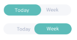

# Text Toggle

I have created the skeleton for an ionic component in
`src\components\text-toggle`.

The objective here is for you to style the component by updating its HTML and
SCSS files so that the included component on the home page looks as close as
possible to the included mock up image.

I do not require any animation, but ideally it will be marked up in such a way
where it would be reasonably simple to override colors via a page or parent
components SCSS.

This project is not purely theoretical. It will be used in our production
application.
